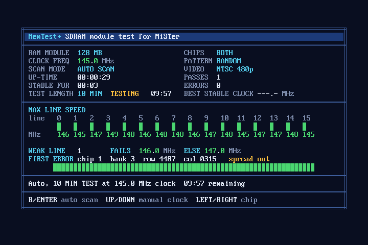

# MemTest+ for MiSTer

An SDRAM module test core for the [MiSTer](https://github.com/MiSTer-devel/Main_MiSTer) FPGA platform, with a screen that says what it
is looking at. It is a new core, not a fork: the screen, the video timing, the test patterns, the error finding and the scan are new.
The way the test writes and reads the memory, and the table of 64 SDRAM clocks (167 MHz down to 45 MHz), come from
[MiSTer-devel/MemTest_MiSTer](https://github.com/MiSTer-devel/MemTest_MiSTer) by Sorgelig.



## What it does

It writes the whole module with a data pattern, reads it back, compares, and starts again, at an SDRAM clock that it sets by
reconfiguring the PLL.

The **auto scan** starts at 167 MHz. Every time a pass finds errors it finishes that pass and steps the clock down, until the module has
run error-free at one clock for the whole *test length* (10 minutes by default). A good module is stable at 130 MHz or more.

| Result | Meaning |
|---|---|
| TESTING | the test is running; the time left is shown |
| PASS | error-free for the whole test length at 130 MHz or more |
| SLOW | stable, but only below 130 MHz |
| FAIL | errors at every clock down to 45 MHz |
| NO MODULE | no SDRAM board found |

## The screen

- **Top block**: module size, chips under test, clock, scan mode, up-time, time stable at this clock, test length and time left, the
  pattern, the video mode, the passes and the errors, and the best stable clock found.
- **Max line speed**: for each of the 16 data lines, the clock where it first worked. The square is red until the line works; the
  number is green from 130 MHz and red below.
- **Weak line**: the data line still wrong at the slowest failing clock (**FAILS**, the clock it fails at), and the clock the module
  would reach without it (**ELSE**).
- **First error**: chip, bank, row and column of the first error, and whether the errors are in one area or spread out.
- **Address map**: the module in 64 parts: grey not yet tested in this pass, green tested without errors, red with errors.
- **Message line**: the clock and the time left while testing, and the explanation of the result when it ends.

## Controls

| | keyboard | pad |
|---|---|---|
| auto scan again from 167 MHz | B or ENTER | first button (Auto scan) |
| faster / slower clock (manual mode) | UP / DOWN | UP / DOWN |
| chip: both / first / second (128 MB modules) | RIGHT / LEFT | RIGHT / LEFT |

The menu (F12) has:

| Option | Choices |
|---|---|
| Pattern | Random, Walking 1/0, Address, Checkerboard, All in turn |
| Test time | 10 min, 1 min, 2 min, 5 min, 30 min, 60 min |
| Video | Auto, NTSC 480p, NTSC 240p, PAL 576p, PAL 288p |
| Chips | Both, 1, 2 (128 MB modules only) |
| Restart auto scan | |

"Auto" video follows `forced_scandoubler` of `MiSTer.ini`.

## Video

Standard timings at 27 MHz: NTSC 858 x 525 (480p, 31.469 kHz, 59.94 Hz) and 858 x 262 (240p, 15.734 kHz, 60.05 Hz), PAL 864 x 625
(576p, 31.25 kHz, 50.00 Hz) and 864 x 312 (288p, 15.625 kHz, 50.08 Hz). 720 active pixels, both syncs negative. The text screen is
80 x 28 cells.

## Install

Copy the `.rbf` to `/media/fat/_Utility/` on the MiSTer's SD card and start it from the Utility menu.

## Building

```
git clone https://github.com/synrais/MiSTer_MemTestPlus
```

Requirements: Docker (the `theypsilon/quartus-lite-c5:17.0.2` image, Quartus Lite 17.0.2), Python 3 with Pillow for the tools,
and [Icarus Verilog](https://github.com/steveicarus/iverilog) 12 for the simulations.

```
build_seeds.bat FIRST LAST
```

builds seeds one after another in the Quartus image and keeps the builds that meet timing in `Builds/` as
`memtestplus_seedN_+SLACK.rbf`. The SDRAM interface at 167 MHz is the tight part of the design, so only some seeds meet timing.
(`build_seeds.bat` is a Windows batch file; the Docker command inside it runs the same way elsewhere.)

Generated files are committed, so they only need regenerating after changing their source:

- `python tools/make_ui.py` makes the screen files in `rtl/` and a preview in `build/` from `ui/layout.txt`. The markup is described at
  the top of the script.
- `python tools/make_clk.py path/to/MemTest_MiSTer/memtest.sv` makes `rtl/clk_steps.sv` from the clock table of the original core.
- `python tools/gen_sim_ports.py` makes the port lists of the whole-core testbench from `sys/emu_ports.vh`.

## Simulation

Run from the repository root with `iverilog -g2012`:

- `sim/tb_tester.sv`: the tester against a behavioural SDRAM with faults.
- `sim/tb_ui.sv`: video timing and the screen, with the demo values of `ui/layout.txt` (writes the frames as PPM).
- `sim/tb_top.sv` with `sim/stubs.sv`: the whole core (`-DSIM`): the scan, weak line, bad rows, no module, chips, keys and pad.

The command lines are at the top of each testbench.

## Repository

| | |
|---|---|
| `rtl/` | the core: top level, tester, SDRAM controller, weak line finder, video timing, text renderer, screen composer, PLLs |
| `ui/layout.txt` | the screen |
| `tools/` | generators for the screen files, the clock table and the testbench port lists |
| `sim/` | testbenches, a behavioural SDRAM and stand-ins for the framework |
| `sys/` | the MiSTer framework |
| `build_seeds.bat`, `memtestplus.q*`, `files.qip`, `paths.tcl` | the Quartus project and the seed search |

## License

GPL v2 or later, as the code it builds on (`LICENSE` is the GNU GPL v3 text). `sdram.v` and the write / read / compare flow of the tester
are derived from MemTest_MiSTer, Copyright (C) 2017-2019 Sorgelig. `sys/` is the MiSTer framework with its own copyright headers.
The console fonts in `tools/usr/share/consolefonts/` are used to make the glyph ROMs.
